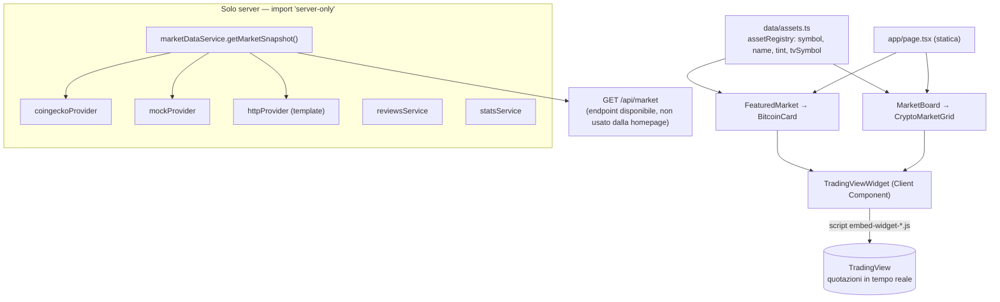
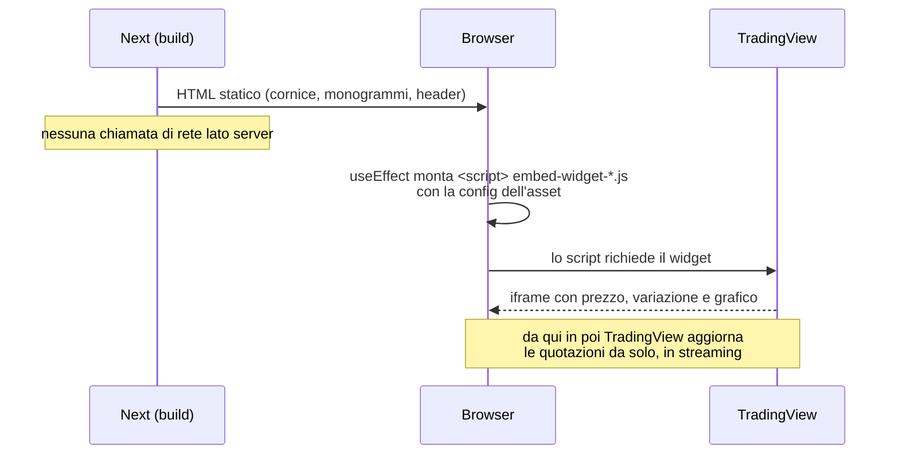
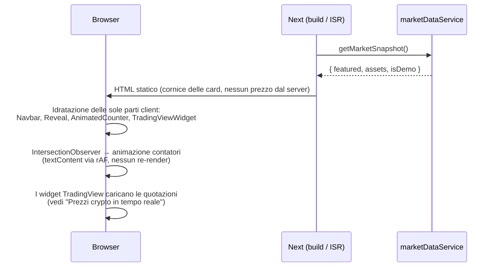

# Piattaforma Crypto — Homepage (v0.1)

Homepage in italiano per una piattaforma crypto/fintech.
Next.js 16 (App Router) · React 19 · TypeScript (strict) · Tailwind CSS 4.

> ⚠️ **Versione dimostrativa.** Statistiche e recensioni sono dati di esempio, etichettati
> come tali nell'interfaccia. I **prezzi crypto sono reali e in tempo reale** (widget
> TradingView), vedi [Prezzi in tempo reale](#prezzi-crypto-in-tempo-reale). Il resto va
> sostituito con dati verificati prima della pubblicazione.

## Avvio

```bash
npm install
cp .env.example .env.local
npm run dev          # http://localhost:3000
```

| Script | Cosa fa |
| --- | --- |
| `npm run dev` | Server di sviluppo |
| `npm run build` | Build di produzione |
| `npm run start` | Avvia la build |
| `npm run lint` | ESLint (config Next core-web-vitals + TypeScript) |
| `npm run typecheck` | Genera i tipi delle route e lancia `tsc --noEmit` |

Requisiti: Node.js 20.9 o superiore.

## Deploy su Vercel

1. Importare il repository su Vercel (framework rilevato automaticamente).
2. Impostare le variabili d'ambiente (vedi `.env.example`), almeno `NEXT_PUBLIC_SITE_URL`.
3. Deploy. Non serve configurazione aggiuntiva.

## Architettura



I prezzi della homepage non passano più dal server: nessuna chiave API, nessun rate
limit, nessuna chiamata che possa fallire in produzione. Il layer
`src/services/market/` resta disponibile dietro `/api/market` per chi volesse tornare a
card disegnate in casa (vedi [Tornare alle card con dati propri](#tornare-alle-card-con-dati-propri)).

### Prezzi crypto in tempo reale

Le card (scheda BTC in evidenza e griglia asset) mostrano quotazioni **reali** servite
dai widget TradingView, che girano nel browser del visitatore:

1. **Un solo componente di embed.** `TradingViewWidget`
   (`src/components/ui/TradingViewWidget.tsx`) riceve il nome dell'embed e la config
   nel formato ufficiale TradingView. Lo `<script>` va creato via DOM e non reso da
   React (React non esegue gli script resi come figli, e l'embed legge la config dal
   contenuto testuale del proprio tag); il container resta vuoto lato React, così il
   cleanup lo svuota senza toccare nodi gestiti da React — necessario con
   `reactStrictMode`, che in sviluppo monta gli effetti due volte.
2. **Un simbolo per asset, in un posto solo.** `tvSymbol` in `src/data/assets.ts`
   (`BINANCE:BTCUSDT`, `BINANCE:ETHUSDT`, …). Cambiare exchange o coppia significa
   modificare quella riga e basta.
3. **Due widget.** Scheda in evidenza → `symbol-overview` (prezzo, variazione, grafico
   ad area). Ogni card della griglia → `mini-symbol-overview` (prezzo, variazione, mini
   grafico). La cornice del sito (pannello, monogrammi, tipografia, header di sezione)
   resta quella di prima: TradingView riempie solo la parte dati.



Cambiare widget o config = sostituire l'oggetto `config` passato a `TradingViewWidget`
con quello generato dal [widget builder di TradingView](https://www.tradingview.com/widget/).

### Tornare alle card con dati propri

Il layer `src/services/market/` (provider CoinGecko / mock / HTTP, tipi, endpoint
`/api/market`) è intatto e funzionante: serve se un giorno si vuole tornare a card
disegnate in casa, con capitalizzazione e volumi che i widget non espongono. In quel
caso i componenti presentazionali originali (`Sparkline`, `PriceChart`, `ChangeBadge`,
`MarketState`) sono ancora nel repo, e le variabili `MARKET_DATA_*` / `COINGECKO_API_KEY`
tornano rilevanti. Attenzione: sul piano gratuito senza chiave, CoinGecko rifiuta spesso
le richieste dagli IP dei datacenter (Vercel incluso) — con quel percorso serve una
chiave API.

### Rendering della pagina



## Dove modificare i contenuti

| Cosa | File |
| --- | --- |
| Nome azienda, URL, modalità demo | `src/data/site.ts` |
| Testi di tutte le sezioni, disclaimer | `src/data/content.ts` |
| Menu e footer, pagine segnaposto | `src/data/navigation.ts` |
| Asset in homepage, simboli TradingView (`tvSymbol`) | `src/data/assets.ts` |
| Config dei widget di quotazione | `BitcoinCard.tsx`, `CryptoMarketGrid.tsx` |
| Componente di embed TradingView | `src/components/ui/TradingViewWidget.tsx` |
| Quotazioni demo (solo per `/api/market` con `MARKET_DATA_PROVIDER=mock`) | `src/data/market.mock.ts` |
| Blockchain (il diagramma si adatta da solo) | `src/data/chains.ts` |
| Funzionalità, passaggi | `src/data/features.ts`, `src/data/steps.ts` |
| Statistiche (`isDemo`, `source`) | `src/data/stats.mock.ts` |
| Recensioni | `src/data/reviews.mock.ts` → `src/services/content/reviewsService.ts` |

## Punti da verificare prima dell'audit

1. **"Tasso di successo comprovato."** (`content.ts`): "comprovato" afferma una prova. La metrica si mostra solo se `verifiedMetric` include una fonte.
2. **"Regolamento rapido"** (`features.ts`): sostituisce "istantaneo" finché non è tecnicamente verificato.
3. **Statistiche e recensioni**: tutte marcate come dimostrative, tranne "Blockchain supportate" (derivata dalla configurazione) e i **prezzi crypto** (reali, via TradingView).
   I termini d'uso dei widget richiedono l'attribuzione visibile a TradingView: è il link `TradingViewCredit`, da non rimuovere.
4. **Indicizzazione**: con `demoMode: true` il sito è `noindex` e `robots.txt` blocca tutto.
5. **Autenticazione**: `/accedi` e `/registrati` sono pagine informative, senza form finti. Integrare un sistema reale lato server (sessioni sicure, cookie httpOnly).
6. **Testi legali e disclaimer**: segnaposto da far redigere al consulente legale (quadro MiCA / autorità italiane).
7. **Sicurezza**: header di base in `next.config.ts`. Aggiungere una Content-Security-Policy con nonce quando verranno integrati servizi esterni.
8. **Loghi di crypto e chain**: sono monogrammi neutri. Per i loghi ufficiali servono asset con licenza.

## Scelte tecniche

- **Prezzi in tempo reale**: widget TradingView lato client — nessuna chiave API, nessun rate limit, nessuna chiamata dal server che possa fallire. Vedi [Prezzi crypto in tempo reale](#prezzi-crypto-in-tempo-reale).
- **Grafici**: i grafici delle quotazioni arrivano dai widget. Gli altri grafici del sito restano SVG puro renderizzato sul server, senza librerie di charting.
- **Contatori**: il server rende il valore finale (SEO e no-JS); il client anima via `requestAnimationFrame` scrivendo `textContent`.
- **Animazioni**: rispettano `prefers-reduced-motion`. I reveal nascondono il contenuto solo se JS è attivo (`@media (scripting: enabled)`).
- **Font**: Mona Sans Variable auto-ospitato via npm, nessuna richiesta a Google Fonts.
- **Dipendenze runtime**: `next`, `react`, `react-dom`, `@fontsource-variable/mona-sans`, `server-only`.
