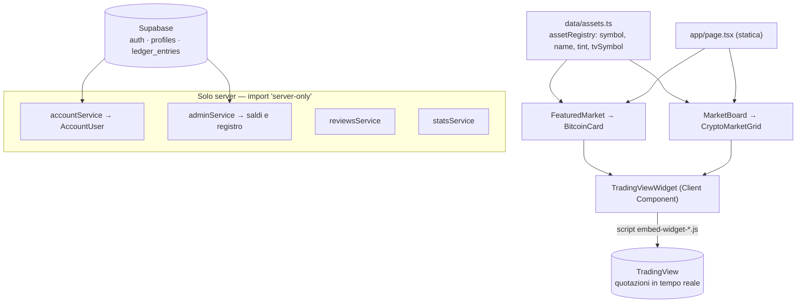
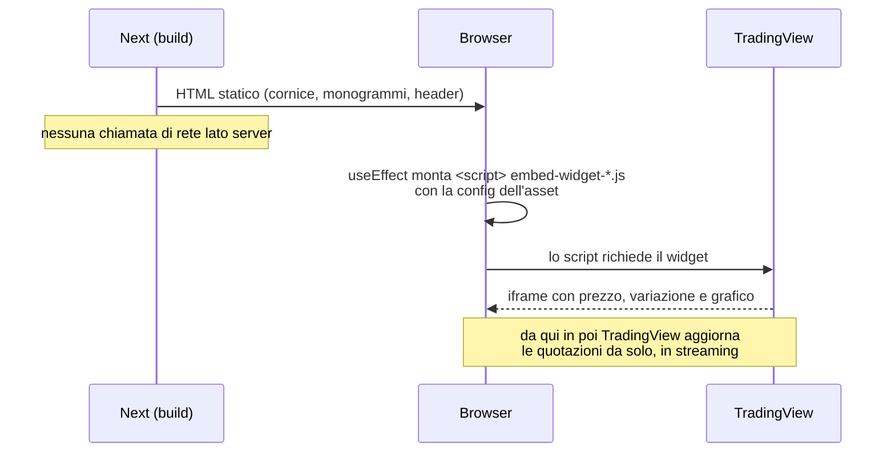
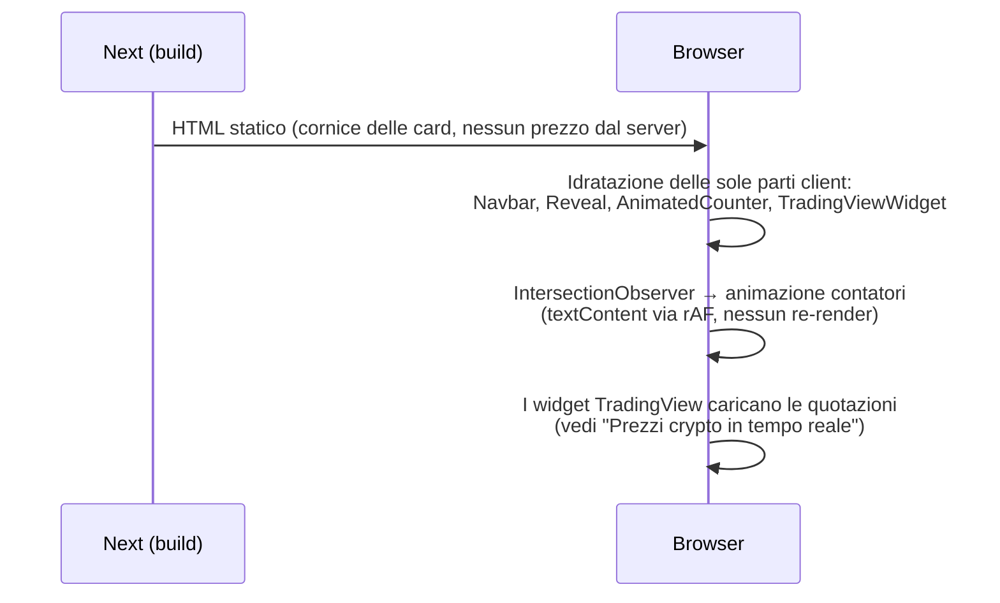
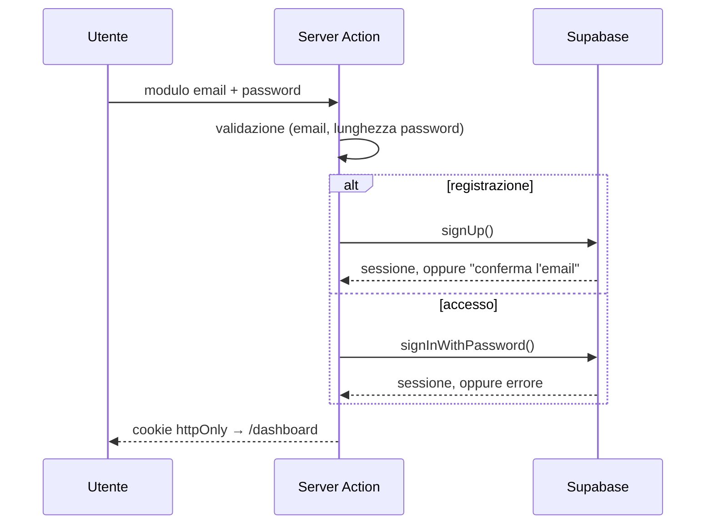
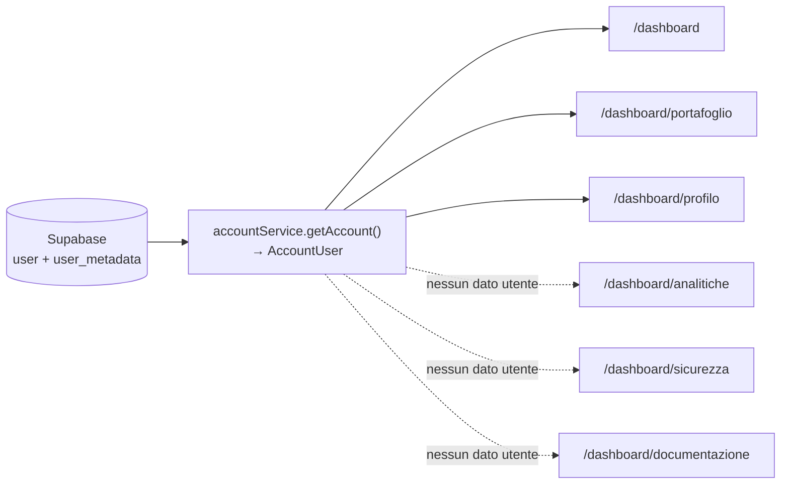

# Piattaforma Crypto — Homepage (v0.1)

Homepage in italiano per una piattaforma crypto/fintech.
Next.js 16 (App Router) · React 19 · TypeScript (strict) · Tailwind CSS 4.

> ⚠️ **Versione dimostrativa.** Statistiche e recensioni sono dati di esempio, etichettati
> come tali nell'interfaccia. I **prezzi crypto sono reali e in tempo reale** (widget
> TradingView), vedi [Prezzi in tempo reale](#prezzi-crypto-in-tempo-reale). Il resto va
> sostituito con dati verificati prima della pubblicazione.

## Avvio

```bash
npm install
cp .env.example .env.local
npm run dev          # http://localhost:3000
```

| Script | Cosa fa |
| --- | --- |
| `npm run dev` | Server di sviluppo |
| `npm run build` | Build di produzione |
| `npm run start` | Avvia la build |
| `npm run lint` | ESLint (config Next core-web-vitals + TypeScript) |
| `npm run typecheck` | Genera i tipi delle route e lancia `tsc --noEmit` |

Requisiti: Node.js 20.9 o superiore.

## Deploy su Vercel

1. Importare il repository su Vercel (framework rilevato automaticamente).
2. Impostare le variabili d'ambiente (vedi `.env.example`), almeno `NEXT_PUBLIC_SITE_URL`.
3. Deploy. Non serve configurazione aggiuntiva.

## Architettura



Nessun prezzo passa dal server: niente chiavi API, niente rate limit, nessuna
chiamata che possa fallire in produzione. Lato server restano solo i dati del
conto, che arrivano da Supabase.

### Prezzi crypto in tempo reale

Le card (scheda BTC in evidenza e griglia asset) mostrano quotazioni **reali** servite
dai widget TradingView, che girano nel browser del visitatore:

1. **Un solo componente di embed.** `TradingViewWidget`
   (`src/components/ui/TradingViewWidget.tsx`) riceve il nome dell'embed e la config
   nel formato ufficiale TradingView. Lo `<script>` va creato via DOM e non reso da
   React (React non esegue gli script resi come figli, e l'embed legge la config dal
   contenuto testuale del proprio tag); il container resta vuoto lato React, così il
   cleanup lo svuota senza toccare nodi gestiti da React — necessario con
   `reactStrictMode`, che in sviluppo monta gli effetti due volte.
2. **Un simbolo per asset, in un posto solo.** `tvSymbol` in `src/data/assets.ts`
   (`BINANCE:BTCUSDT`, `BINANCE:ETHUSDT`, …). Cambiare exchange o coppia significa
   modificare quella riga e basta.
3. **Due widget.** Scheda in evidenza → `symbol-overview` (prezzo, variazione, grafico
   ad area). Ogni card della griglia → `mini-symbol-overview` (prezzo, variazione, mini
   grafico). La cornice del sito (pannello, monogrammi, tipografia, header di sezione)
   resta quella di prima: TradingView riempie solo la parte dati.



Cambiare widget o config = sostituire l'oggetto `config` passato a `TradingViewWidget`
con quello generato dal [widget builder di TradingView](https://www.tradingview.com/widget/).

### Rendering della pagina



## Accesso e registrazione

Email e password tramite Supabase. La sessione vive in cookie httpOnly gestiti
da `@supabase/ssr`; la password viaggia solo in una Server Action e non passa
mai dal JavaScript del client.



- **`src/proxy.ts`** — in Next 16 il vecchio `middleware` si chiama `proxy`.
  Rinnova i cookie di sessione a ogni richiesta e blocca `/dashboard` agli anonimi.
- **Doppia serratura**: oltre al proxy, `/dashboard` verifica la sessione lato
  server con `getUser()`, che valida il token contro Supabase invece di fidarsi
  del cookie.
- **Errore unico per le credenziali sbagliate** ("Email o password non corretti"):
  un messaggio diverso per "utente inesistente" direbbe a chiunque quali indirizzi
  sono registrati.
- **Dati raccolti alla registrazione** (nome, cognome, telefono, città, somma indicativa) finiscono
  in `user_metadata` sull'utente Supabase: nessuna tabella da creare, si vedono
  in Authentication → Users e l'area riservata li rilegge da lì.
  ⚠️ `user_metadata` è modificabile dall'utente stesso via API: va bene per
  mostrare un nome, non per decisioni di sicurezza. Quando serviranno dati
  affidabili — o interrogabili in SQL — vanno spostati in una tabella `profiles`
  con RLS, popolata da un trigger su `auth.users`.
- **Conferma dell'email**: se è attiva su Supabase, dopo la registrazione non
  parte la sessione e compare l'avviso di controllare la posta; il link di
  conferma rientra da `/auth/callback`. Disattivandola (Authentication →
  Sign In / Providers → Email → *Confirm email*) l'accesso è immediato.
- **Senza le chiavi configurate** il sito funziona lo stesso: `/accedi` e
  `/registrati` mostrano un avviso al posto del modulo, e la build non si rompe.

> ⚠️ Soluzione provvisoria: mancano ancora recupero password, limitazione dei
> tentativi e requisiti di robustezza oltre agli 8 caratteri minimi.

Configurazione: vedi `.env.example`.

## Area riservata

Sei pagine sotto `/dashboard`, con sidebar fissa da `lg` in su e drawer sotto.
Stessi token di colore del sito pubblico: nessun valore esadecimale nuovo.



- **Formattazione del denaro deterministica**: `formatAmount` e `formatBtc`
  costruiscono la stringa a mano invece di usare `Intl`. Per l'italiano i dati
  ICU impostano `minimumGroupingDigits=2`, e Node e il browser lo applicano in
  modo diverso (`1750,40 €` contro `1.750,40 €`): su cifre che compaiono sia
  nell'HTML del server sia dopo l'idratazione, basta quello a rompere React.
- **Un solo provider per i cambi**: `RatesProvider` chiede i cambi bitcoin una
  volta per pagina, dal browser del visitatore, e li condivide con la barra
  laterale, le caselle in alto e i conti in valuta.
- **Una sola fonte dei dati**: `src/services/account/accountService.ts` traduce
  l'utente Supabase in `AccountUser`. Username e saldo non sono mai riscritti a
  mano in una pagina: quando arriverà un backend di pagamenti cambia solo quel file.
- **Valuta unica: EUR**, dal conto ai widget della homepage (`siteConfig.currency`,
  coppie `BINANCE:*EUR`, widget CoinMarketCap su base EUR).
- **Controvalore in bitcoin** sotto al saldo: il cambio EUR/BTC si chiede dal
  browser del visitatore, non dal server, perché CoinGecko rifiuta spesso gli IP
  dei datacenter. Se il cambio non arriva la conversione non viene mostrata:
  su un saldo un numero sbagliato è peggio di un numero assente.
- **Saldo 0, wallet null, nessun movimento**: non esiste ancora un sistema di
  pagamenti, quindi le pagine mostrano stati vuoti dichiarati invece di numeri o
  indirizzi inventati. Su una piattaforma finanziaria un dato finto è peggio di
  uno spazio vuoto.
- **Azioni non ancora collegate** (Deposita, Esporta chiave, Modifica profilo,
  Modifica password, Configura 2FA) usano un unico `PlaceholderAction`, che apre
  una modale dicendo apertamente che la funzione non è attiva.
- **Caricamento documenti**: solo lato client. I file restano in memoria, non
  vengono inviati a nessun server e **non** finiscono in `localStorage`; non ne
  viene generata alcuna anteprima, quindi il contenuto non viene mai interpretato
  dal browser. Tipo e dimensione sono filtrati (PNG/JPG/PDF, max 10 MB), ma il
  tipo dichiarato dal browser non è una garanzia: la verifica vera andrà fatta
  lato server quando ci sarà uno storage autenticato e privato.
- **Voce di menu attiva**: vince la corrispondenza più lunga, altrimenti
  `/dashboard` resterebbe acceso su ogni sottopagina.

## Amministrazione e saldi

`/dashboard/admin`, visibile solo a chi ha `is_admin` nel database. Serve al
caso concreto: un deposito che per un problema tecnico non risulta accreditato,
e va sistemato a mano lasciando traccia.

**Prima di usarlo** va eseguita una volta `supabase/migrations/0001_profiles_and_ledger.sql`
nell'SQL Editor di Supabase, e poi nominato il primo amministratore:

```sql
update public.profiles set is_admin = true where email = 'tua@email.it';
```

Finché la migrazione non è stata eseguita il sito continua a funzionare: la
dashboard mostra un avviso al posto del saldo, invece di un numero inventato.

- **Il saldo non sta in `user_metadata`.** Quel campo è modificabile dall'utente
  stesso via API: chiunque potrebbe assegnarsi il denaro che vuole. Vive nella
  tabella `profiles`, su cui l'app non ha alcun permesso di scrittura diretta.
- **Importi in centesimi interi** (`bigint`), mai in virgola mobile: `0.1 + 0.2`
  non fa `0.3`. La conversione da testo a centesimi (`src/lib/money.ts`) separa
  le cifre come stringhe e rifiuta gli input ambigui — `"1.234"` può valere
  milleduecentotrentaquattro o uno virgola due tre quattro, e sbagliare
  significherebbe sbagliare di mille volte.
- **Saldo e registro cambiano insieme**, dentro `admin_adjust_balance`: una sola
  transazione, quindi o si scrivono entrambi o nessuno dei due.
- **Il controllo sul ruolo è nel database**, non nell'interfaccia. Nascondere la
  voce di menu è ordine, non sicurezza: a fermare davvero una chiamata sono le
  policy RLS e il controllo dentro la funzione SQL, che un client non può
  aggirare nemmeno parlando direttamente con Supabase.
- **Il registro è in sola aggiunta**: ogni movimento conserva importo, saldo
  risultante, motivo obbligatorio, chi l'ha fatto e quando.
- Un amministratore non può revocare sé stesso: lo impedisce la funzione SQL.

## Dove modificare i contenuti

**Quasi tutti i testi del sito stanno in un unico file: [`src/data/content.ts`](src/data/content.ts).**
Le sezioni sono nell'ordine in cui compaiono nella pagina, dall'alto verso il basso:
nome azienda, menu, hero, titoli di ogni sezione, funzionalità, passaggi, footer e
testo legale. Per cambiare una scritta basta modificare quello che sta fra virgolette.

Il resto sono elenchi di dati, tenuti separati:

| Cosa | File |
| --- | --- |
| **Tutti i testi, menu e footer** | **`src/data/content.ts`** |
| Asset in homepage, simboli TradingView (`tvSymbol`) | `src/data/assets.ts` |
| Config dei widget di quotazione | `BitcoinCard.tsx`, `CryptoMarketGrid.tsx` |
| Componente di embed TradingView | `src/components/ui/TradingViewWidget.tsx` |
| Blockchain (il diagramma si adatta da solo) | `src/data/chains.ts` |
| Statistiche (`isDemo`, `source`) | `src/data/stats.mock.ts` |
| Recensioni | `src/data/reviews.mock.ts` → `src/services/content/reviewsService.ts` |

## Punti da verificare prima dell'audit

1. **"Tasso di successo comprovato."** (`content.ts`): "comprovato" afferma una prova. La metrica si mostra solo se `verifiedMetric` include una fonte.
2. **"Regolamento rapido"** (`features.ts`): sostituisce "istantaneo" finché non è tecnicamente verificato.
3. **Statistiche e recensioni**: tutte marcate come dimostrative, tranne "Blockchain supportate" (derivata dalla configurazione) e i **prezzi crypto** (reali, via TradingView).
   I termini d'uso dei widget richiedono l'attribuzione visibile a TradingView: è il link `TradingViewCredit`, da non rimuovere.
4. **Indicizzazione**: con `demoMode: true` il sito è `noindex` e `robots.txt` blocca tutto.
5. **Autenticazione**: email e password via Supabase, sessione in cookie httpOnly. Provvisoria: manca il recupero password. Vedi [Accesso e registrazione](#accesso-e-registrazione). Prima di aprire le registrazioni al pubblico servono privacy policy e termini reali (oggi sono segnaposto).
6. **Testi legali e disclaimer**: segnaposto da far redigere al consulente legale (quadro MiCA / autorità italiane).
7. **Sicurezza**: header di base in `next.config.ts`. Aggiungere una Content-Security-Policy con nonce quando verranno integrati servizi esterni.
8. **Loghi di crypto e chain**: sono monogrammi neutri. Per i loghi ufficiali servono asset con licenza.

## Scelte tecniche

- **Prezzi in tempo reale**: widget TradingView lato client — nessuna chiave API, nessun rate limit, nessuna chiamata dal server che possa fallire. Vedi [Prezzi crypto in tempo reale](#prezzi-crypto-in-tempo-reale).
- **Grafici**: i grafici delle quotazioni arrivano dai widget. Gli altri grafici del sito restano SVG puro renderizzato sul server, senza librerie di charting.
- **Contatori**: il server rende il valore finale (SEO e no-JS); il client anima via `requestAnimationFrame` scrivendo `textContent`.
- **Animazioni**: rispettano `prefers-reduced-motion`. I reveal nascondono il contenuto solo se JS è attivo (`@media (scripting: enabled)`).
- **Font**: Mona Sans Variable auto-ospitato via npm, nessuna richiesta a Google Fonts.
- **Dipendenze runtime**: `next`, `react`, `react-dom`, `@fontsource-variable/mona-sans`, `server-only`.
