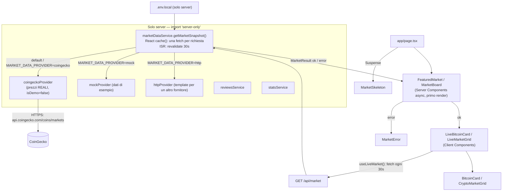
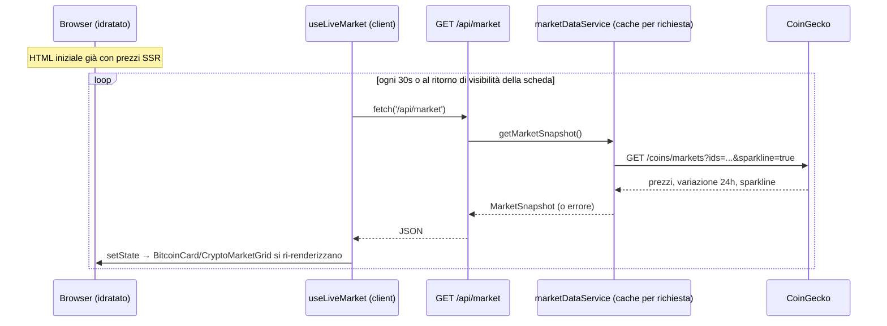
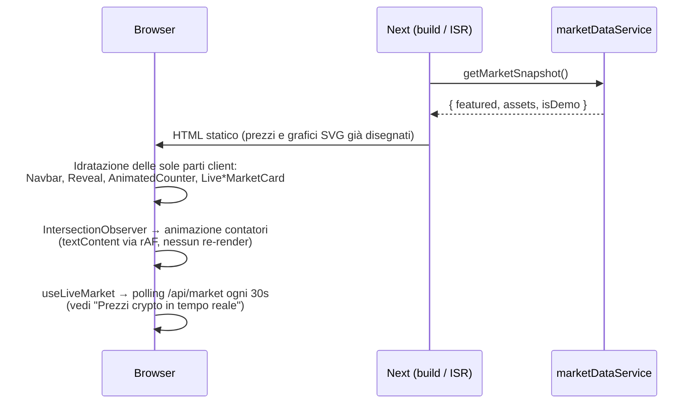
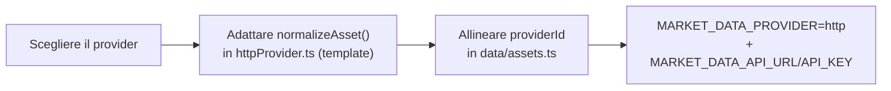

# Piattaforma Crypto — Homepage (v0.1)

Homepage in italiano per una piattaforma crypto/fintech.
Next.js 16 (App Router) · React 19 · TypeScript (strict) · Tailwind CSS 4.

> ⚠️ **Versione dimostrativa.** Statistiche e recensioni sono dati di esempio, etichettati
> come tali nell'interfaccia. I **prezzi crypto sono reali e in tempo reale** (CoinGecko),
> vedi [Prezzi in tempo reale](#prezzi-crypto-in-tempo-reale). Il resto va sostituito con
> dati verificati prima della pubblicazione.

## Avvio

```bash
npm install
cp .env.example .env.local
npm run dev          # http://localhost:3000
```

| Script | Cosa fa |
| --- | --- |
| `npm run dev` | Server di sviluppo |
| `npm run build` | Build di produzione |
| `npm run start` | Avvia la build |
| `npm run lint` | ESLint (config Next core-web-vitals + TypeScript) |
| `npm run typecheck` | Genera i tipi delle route e lancia `tsc --noEmit` |

Requisiti: Node.js 20.9 o superiore.

## Deploy su Vercel

1. Importare il repository su Vercel (framework rilevato automaticamente).
2. Impostare le variabili d'ambiente (vedi `.env.example`), almeno `NEXT_PUBLIC_SITE_URL`.
3. Deploy. Non serve configurazione aggiuntiva.

## Architettura



La UI dipende solo dai tipi in `src/services/market/types.ts`, mai dai dati mock.

### Prezzi crypto in tempo reale

Le card (scheda BTC in evidenza e griglia asset) mostrano quotazioni **reali**, non demo:

1. **Provider di default: CoinGecko.** `coingeckoProvider` (`src/services/market/providers/coingeckoProvider.ts`)
   chiama `GET /coins/markets` per gli asset in `src/data/assets.ts` (i cui `providerId`
   — `bitcoin`, `ethereum`, `solana`, `binancecoin`, `ripple`, `cardano` — sono già gli ID
   CoinGecko) e normalizza la risposta nel tipo `MarketAsset` interno, senza mai fidarsi
   della forma dei dati esterni. Non serve una chiave API: se impostata,
   `COINGECKO_API_KEY` viene inviata come header per un rate limit più alto.
2. **Primo render lato server (SSR/ISR).** `FeaturedMarket`/`MarketBoard` chiamano
   `getMarketSnapshot()` come prima: HTML già pronto con i prezzi correnti, cache ISR
   di `MARKET_DATA_REVALIDATE_SECONDS` (default 30s) per non superare i rate limit.
3. **Aggiornamento lato client senza reload.** Da lì in poi entrano in gioco i wrapper
   client `LiveBitcoinCard` e `LiveMarketGrid`: l'hook `useLiveMarket`
   (`src/hooks/useLiveMarket.ts`) interroga `GET /api/market` ogni 30s (e subito quando
   la scheda torna visibile) e aggiorna lo stato React — le card presentazionali
   (`BitcoinCard`, `CryptoMarketGrid`) restano invariate, ricevono solo dati più freschi.
   In caso di rete assente il badge passa da "Tempo reale" a "In pausa" mantenendo
   l'ultimo prezzo valido, senza mai rompere la UI.



Per tornare ai dati di esempio (sviluppo offline, demo senza rete): `MARKET_DATA_PROVIDER=mock`.

### Rendering della pagina



## Usare un altro provider di mercato

Il provider di default è CoinGecko. Per collegare un fornitore diverso (es. l'API di un
exchange) invece che modificare `coingeckoProvider.ts`:



- La chiave API resta sul server (niente prefisso `NEXT_PUBLIC_`).
- `MARKET_DATA_REVALIDATE_SECONDS` controlla la cache ISR lato server (default 30s).
- Gli aggiornamenti lato client passano sempre da `/api/market` (mai dal provider
  direttamente): è già collegato da `useLiveMarket`, nessuna modifica necessaria lì.
- Se il provider fallisce, la pagina mostra uno stato d'errore (testato con
  `MARKET_DATA_PROVIDER=http` senza URL, oppure disattivando la rete: CoinGecko
  degrada allo stesso modo).

## Dove modificare i contenuti

| Cosa | File |
| --- | --- |
| Nome azienda, URL, modalità demo | `src/data/site.ts` |
| Testi di tutte le sezioni, disclaimer | `src/data/content.ts` |
| Menu e footer, pagine segnaposto | `src/data/navigation.ts` |
| Asset in homepage (`providerId` = ID CoinGecko) | `src/data/assets.ts` |
| Quotazioni demo (usate solo con `MARKET_DATA_PROVIDER=mock`) | `src/data/market.mock.ts` |
| Provider prezzi reali (CoinGecko) | `src/services/market/providers/coingeckoProvider.ts` |
| Polling client dei prezzi | `src/hooks/useLiveMarket.ts` |
| Blockchain (il diagramma si adatta da solo) | `src/data/chains.ts` |
| Funzionalità, passaggi | `src/data/features.ts`, `src/data/steps.ts` |
| Statistiche (`isDemo`, `source`) | `src/data/stats.mock.ts` |
| Recensioni | `src/data/reviews.mock.ts` → `src/services/content/reviewsService.ts` |

## Punti da verificare prima dell'audit

1. **"Tasso di successo comprovato."** (`content.ts`): "comprovato" afferma una prova. La metrica si mostra solo se `verifiedMetric` include una fonte.
2. **"Regolamento rapido"** (`features.ts`): sostituisce "istantaneo" finché non è tecnicamente verificato.
3. **Statistiche e recensioni**: tutte marcate come dimostrative, tranne "Blockchain supportate" (derivata dalla configurazione) e i **prezzi crypto** (reali, via CoinGecko).
4. **Indicizzazione**: con `demoMode: true` il sito è `noindex` e `robots.txt` blocca tutto.
5. **Autenticazione**: `/accedi` e `/registrati` sono pagine informative, senza form finti. Integrare un sistema reale lato server (sessioni sicure, cookie httpOnly).
6. **Testi legali e disclaimer**: segnaposto da far redigere al consulente legale (quadro MiCA / autorità italiane).
7. **Sicurezza**: header di base in `next.config.ts`. Aggiungere una Content-Security-Policy con nonce quando verranno integrati servizi esterni.
8. **Loghi di crypto e chain**: sono monogrammi neutri. Per i loghi ufficiali servono asset con licenza.

## Scelte tecniche

- **Prezzi in tempo reale**: CoinGecko come provider di default, SSR/ISR (30s) per il primo render, poi polling client via `useLiveMarket` — vedi [Prezzi crypto in tempo reale](#prezzi-crypto-in-tempo-reale).
- **Grafici**: SVG puro renderizzato sul server, nessuna libreria di charting, zero JS nel client.
- **Serie mock**: PRNG deterministico, quindi server e client producono lo stesso output (nessun hydration mismatch). Usata solo con `MARKET_DATA_PROVIDER=mock`.
- **Contatori**: il server rende il valore finale (SEO e no-JS); il client anima via `requestAnimationFrame` scrivendo `textContent`.
- **Animazioni**: rispettano `prefers-reduced-motion`. I reveal nascondono il contenuto solo se JS è attivo (`@media (scripting: enabled)`).
- **Font**: Mona Sans Variable auto-ospitato via npm, nessuna richiesta a Google Fonts.
- **Dipendenze runtime**: `next`, `react`, `react-dom`, `@fontsource-variable/mona-sans`, `server-only`.
